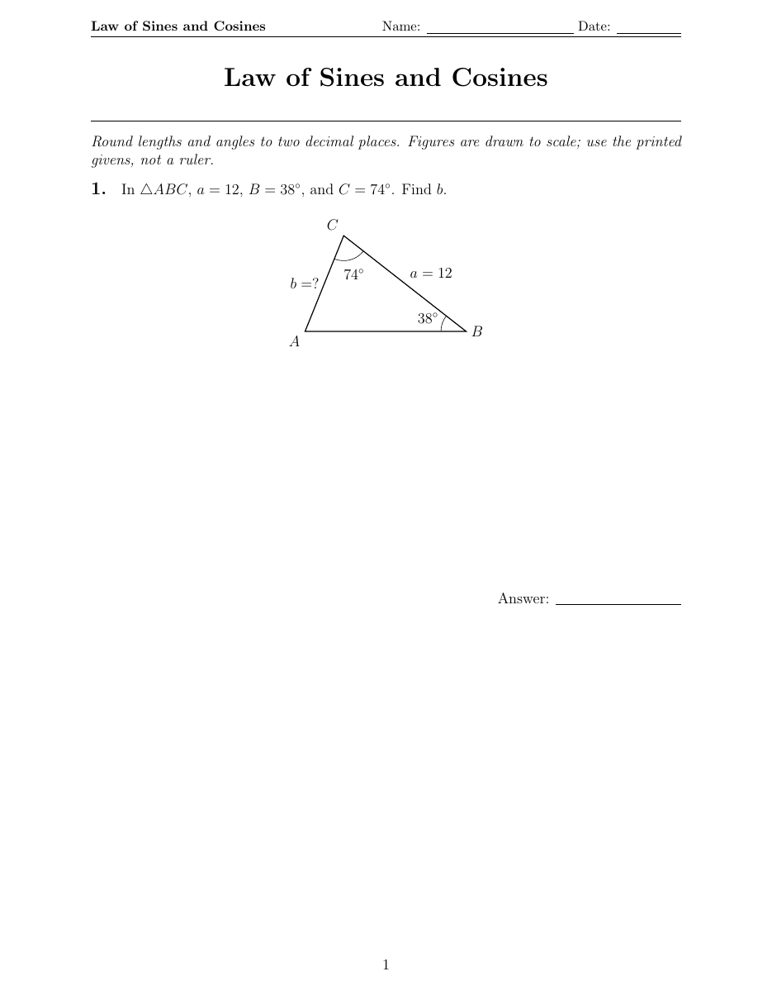
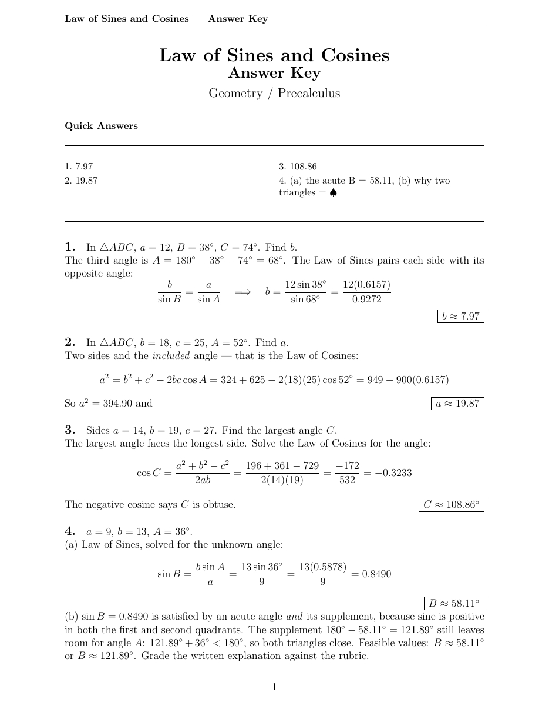
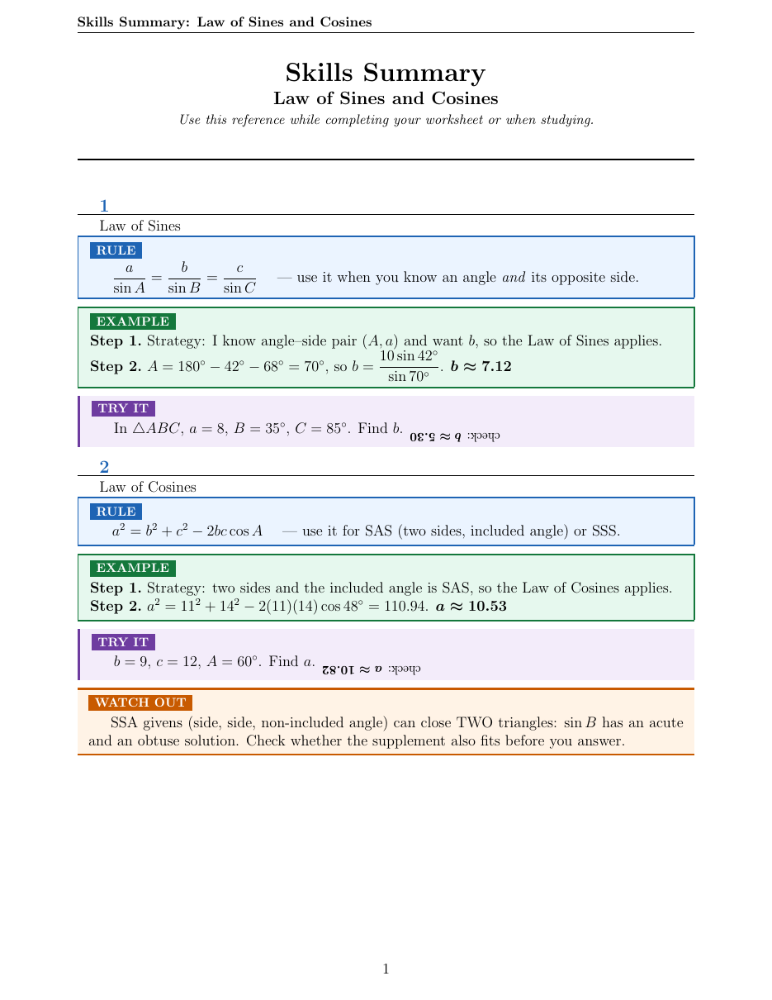
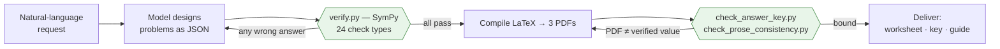

# math-worksheets — Agent Skill

[](https://github.com/stellawuellner/math-worksheets-skill/actions/workflows/tests.yml)
[](tests/coverage.sh)
[](tests/eval_gsm8k.py)


**v3.0.0** · [Changelog](#changelog) · elementary → AP Calculus BC · agent-agnostic · every answer machine-verified

> Ask in plain language — **"make Leo a law-of-sines worksheet"** — and get three print-ready PDFs whose every answer has been checked by a computer algebra system before it reaches a student.

| Worksheet | Answer key | Skills summary |
|:---:|:---:|:---:|
| [](docs/samples/worksheet_geometry-1.png) | [](docs/samples/answerkey_geometry-1.png) | [](docs/samples/skills_summary-1.png) |
| To-scale figures, work space, ramped difficulty | Step-by-step solutions, boxed answers | Formula boxes + worked mini-examples |

*Real, unretouched output. The `read_data` type even renders data charts from the same numbers it verifies:* [data-handling worksheet →](docs/samples/worksheet_data-1.png)

Works with any AI agent that can read files and run shell commands — **OpenClaw**, **Claude Code**, **Gemini**, **Codex** — via the standard `SKILL.md` format, with portable fallbacks for every platform-specific step.

## Why it's different: nothing ships unverified

Most worksheet generators ask a language model for the answers and trust them. This one doesn't. The model proposes problems as **structured data**; a fixed, audited SymPy script decides what's correct; and the printed PDFs are then bound back to those verified values — so a transcription slip in the answer key can't slip through.



The guarantee is enforced, not aspirational: a **mandatory coverage gate** means no problem can be skipped, the verifier's expression parser is a strict **allowlist** (no code execution), and the whole thing is validated against the **GSM8K** and **MATH** datasets with **0 false accepts on ~7,400 checks**. Where a task genuinely can't be machine-checked (proofs, "explain why"), it's honestly marked `manual` rather than faked. See the [Trust model](#trust-model) for the exact boundary.

## Trust model

**Guaranteed** — every problem with a machine-checkable answer is CAS-verified; the mandatory coverage gate (`problem_count`) means no worksheet problem is silently skipped; a fully hand-checked sheet fails unless explicitly acknowledged; and `check_answer_key.py` / `check_prose_consistency.py` bind the printed worksheet, figures, and answer key back to the verified values. Validated on GSM8K and MATH — **0 false accepts on ~7,400 checks**.

**Human review still required** — `manual`-typed problems (proofs, constructions, "explain why", matrices/vectors), the soft alignment warnings from the binding checkers, and any problem whose *statement* is ambiguous. An optional [LLM-judge review aid](references/manual-review-aid.md) flags likely errors in that content first, but does not gate it. Verification proves the math and its transcription — it does not prove pedagogical intent.

## Features

- **Three documents per request** — worksheet, step-by-step answer key, and a skills-summary cheat sheet with formula boxes and worked mini-examples (all three verified).
- **24 verification types, elementary → AP Calc BC** — arithmetic, fractions, `solve`/`factor`/`expand`, `system`, `inequality`, `stats`, `probability`, `read_data` charts, coordinate geometry, `triangle` (law of sines/cosines, SSA-aware), `diff`/`integrate`/`definite_integral`/`limit`/`series`, `estimate`, `compare`, complex numbers, and explicit `manual`. [Full menu →](references/problem-library.md)
- **Provenance binding** — `check_answer_key.py` and `check_prose_consistency.py` confirm the printed worksheet, figures, and answer key match the verified JSON.
- **Standards, difficulty & Bloom** — every problem tags a CCSS/AP code (K–4 through AP CED), a 1–5 difficulty (ramp-checked), and a cognitive level; tiered support/core/challenge worksheets on request. [Standards map →](references/standards-map.md)
- **Publication-quality LaTeX** — a compile-tested figure library (to-scale triangles, circle theorems, the unit circle, trig graphs, 3D solids, data charts, two-column proofs) via `tectonic`, with a `pdflatex` fallback.
- **Auto model detection** — finds the best available reasoning model from the host agent's config; fully local, no network calls.
- **Portable delivery** — chat agents send PDFs back on the originating channel; CLI/IDE agents report the paths.

## Examples

> **You:** *"Leo's studying the law of sines and cosines — make him an 8-problem worksheet with a figure on each, plus an answer key."*

The skill designs 8 ramped problems, writes a `verify.json`, runs it through SymPy (all 8 pass), compiles three PDFs, and confirms every boxed answer in the key matches the verified value — producing exactly the documents shown above, ready to print.

**More you can ask for** — one skill, from counting to Calc BC:

- *"Make Lucy, my 3rd grader, a times-tables worksheet — 12 problems with a study guide."*
- *"Factoring trinomials for an 8th grader, 15 problems, mixed difficulty."*
- *"A data-handling sheet: read values off a bar chart, then mean / median / mode / range — 8 problems."*
- *"AP Calc chain-rule practice, 10 problems, full worked answer key."*
- *"Systems of equations aligned to 8.EE.C.8, with a scaffolded support tier and a challenge tier."*
- *"Leo needs graphing-polynomials practice — use his homework photo as the style guide."*

The skill handles the rest: model selection, problem design, SymPy verification, answer-key and figure binding, compile, and delivery on whatever channel the request came from.

## Install

### OpenClaw

```bash
openclaw skills install math-worksheets
```

Or download `math-worksheets.skill` from [ClawhHub](https://clawhub.com) and install locally.

### Claude Code

Clone into your skills directory (personal or per-project):

```bash
git clone https://github.com/stellawuellner/math-worksheets-skill ~/.claude/skills/math-worksheets
# or, for a single project:
git clone https://github.com/stellawuellner/math-worksheets-skill .claude/skills/math-worksheets
```

Claude Code picks up the skill from `SKILL.md` automatically.

### Gemini, Codex, and other agents

Clone the repo anywhere and point the agent at it — e.g. reference the skill from your `GEMINI.md` / `AGENTS.md` context file, or just say:

> *"Follow the instructions in ~/skills/math-worksheets/SKILL.md to make a worksheet on factoring trinomials."*

Everything in the skill is plain markdown, bash, and Python — no agent-specific runtime is required.

### Prerequisites (all platforms)

**tectonic** — the LaTeX compiler (auto-downloads packages on first use):

```bash
brew install tectonic       # macOS or Linux with Homebrew
cargo install tectonic      # any platform with Rust
sudo apt install tectonic   # Debian/Ubuntu (recent releases)
# or a release binary: https://github.com/tectonic-typesetting/tectonic/releases
```

**Python 3** with **sympy** for answer verification:

```bash
pip3 install "sympy>=1.12"   # bundles mpmath, used for numerical checks
```

Verification behavior is CAS-version-specific; the corpus baselines (GSM8K, MATH) were established on SymPy 1.14. The verifier prints the SymPy version it ran with in its report.

No tectonic? `compile.sh` falls back to `pdflatex` — install the package set up front since pdflatex can't auto-download: `texlive-latex-base texlive-pictures texlive-latex-recommended texlive-latex-extra`.

## Skill Contents

```
math-worksheets/
├── SKILL.md                          ← workflow and instructions
├── LICENSE                           ← MIT
├── scripts/
│   ├── check_reasoning_model.sh     ← auto-detects best available model (local only)
│   ├── compile.sh                   ← tectonic/pdflatex PDF compiler wrapper
│   ├── run_verify.sh                ← gates compilation on SymPy pass
│   └── verify.py                    ← the fixed, audited verifier (24 check types)
├── references/
│   ├── latex-templates.md           ← LaTeX patterns (planes, figures, charts, answer key)
│   ├── problem-library.md           ← problem menu + verification recipes, K → Calc BC
│   ├── standards-map.md             ← CCSS (K–4, 5–8, HS) + AP CED codes; difficulty ladders
│   ├── manual-review-aid.md         ← optional LLM-judge pass for open reasoning
│   ├── model-rankings.md / .json    ← model guidance
├── tests/
│   ├── run_tests.sh                 ← regression suite (pass/fail/injection/schema fixtures)
│   ├── test_audit_fixes.py          ← soundness-regression pins from the trust audit
│   ├── check_answer_key.py          ← binds printed answer key to verified JSON
│   ├── check_prose_consistency.py   ← binds worksheet prose + figure labels to JSON
│   ├── eval_gsm8k.py / eval_math_dataset.py  ← corpus evals
│   └── fixtures/
└── .github/workflows/tests.yml       ← CI: runs both suites on every push
```

## Testing

```bash
bash tests/run_tests.sh          # verifier contract (18 fixtures)
bash tests/coverage.sh           # all suites under coverage, floor 90%
```

`coverage.sh` runs the fixture suite plus three Python suites — `test_audit_fixes.py` (soundness-regression pins from two adversarial audits, 33 assertions), `test_error_paths.py` (input-validation for every type), and `test_branches.py` (numeric fallbacks and verdict variants) — under `coverage`, and fails below **90%** (currently **91%**). Fixtures pin the contract: correct keys exit 0, wrong answers exit 1, manual-only exit 2, and injection/schema violations exit 1 without executing anything. CI runs everything on every push. For deeper validation, the corpus evals check the verifier against GSM8K and the MATH dataset — **0 false accepts on ~7,400 checks**.

> The coverage and false-accept badges reflect the enforced CI floor and the last corpus run; connect the repo to Codecov if you want a live coverage badge.

## Changelog

### v3.0.0 — 2026-07-20
- **Trust audit + hardening (breaking-adjacent):** an independent adversarial audit found and fixed soundness gaps confirmed by execution — `solve`/`zeros` no longer silently drop complex roots (declare `"domain"`), `integrate` rejects domain-invalid antiderivatives (`ln(x)` for `1/x`), the numeric-equality fallback no longer accepts a crafted vanishing-polynomial, `approx`/`triangle` use scale-aware tolerance, and `solve_interval` confirms completeness via mpmath instead of a blanket manual downgrade. Pinned by `tests/test_audit_fixes.py`.
- **Mandatory coverage gate + provenance binding:** `problem_count` is now required and an all-manual sheet fails unless acknowledged; `tests/check_answer_key.py` binds the printed answer key to the verified JSON, and `check_prose_consistency.py` now also checks figure-label numbers. The skills summary is verified through its own `verify_ss` JSON.
- **New verify types:** `system`, `series`, `inequality`, complex via `I`, `stats` (mean/median/mode/range/variance/stdev/quartiles), `probability`, `read_data` (charts/tables), `definite_integral` (mpmath quadrature), `estimate`, and `compare` — plus task-reframing recipes that turn many "understanding" topics into checkable tasks. 24 types total.
- **Standards, difficulty, Bloom:** per-problem `standard` (K–4 through HS + AP CED, in `references/standards-map.md`), `difficulty` (1–5 ladders, ramp-checked), and `bloom` tags; tiered-differentiation workflow.
- **Coverage:** elementary → AP Calculus BC; validated against the Marble OS-taxonomy (503 topics) — ~61% machine-verifiable, with an honest `manual` boundary for open reasoning (optional LLM-judge review aid in `references/manual-review-aid.md`).
- **Portability & release:** agent-agnostic (OpenClaw/Claude Code/Gemini/Codex); pdflatex fallback; SymPy pinned and version-stamped; MIT `LICENSE`; CI runs the test suites on every push.
- **Testing:** regression suite (18 fixtures incl. injection/schema/coverage) + audit-fix suite (21 assertions); verifier validated on GSM8K (4282/4282) and MATH (2711/2711) with 0 false accepts.

### v2.3.0 — 2026-07-20
- **Geometry & trig verification:** Six new check types — `approx` (tolerance-based comparison for rounded answers, the workhorse for measurement problems), `distance`, `midpoint`, `slope` (with `"undefined"` for vertical lines), `polygon_area` (shoelace over raw vertices), and `triangle` (full SSS/SAS/ASA/AAS/SSA solver via law of sines/cosines in fixed code, accepting either triangle in the ambiguous SSA case). Geometry types take raw givens — points, sides, angles — so the model transcribes data and the audited script does the formulas
- **Degree mode:** `solve_interval` and `triangle` accept `"unit": "deg"` so Geometry/Pre-Calc answer keys verify in the units students actually use
- **Figure library:** `latex-templates.md` grows from one figure to a full set — to-scale SAS triangle, parallel lines with transversal, central/inscribed angles, shaded sector, unit circle, radian/degree trig graphs, cylinder/cone/prism/sphere, and a two-column proof template. All templates compile-tested; conventions section requires figures drawn to scale from the problem's actual values
- **Verification recipes:** problem-library.md maps every problem kind to its verify type, so choosing the check is mechanical, not judgment
- Tests: geometry pass/fail fixtures added to the regression suite (31 new cases)

### v2.2.0 — 2026-07-20
- **Scope:** Expanded coverage through AP Calculus AB/BC — limits, derivatives, integrals, differential equations, parametric/polar calculus, and series added to the problem library; skill description updated so calculus requests trigger it
- **Verification:** Five new SymPy check types — `diff` (with optional order), `integrate` (verified by differentiating the expected antiderivative), `limit` (with one-sided support), `equiv` (symbolic equivalence with `trigsimp` and a deterministic numeric fallback for trig identities), and `solve_interval` (trig equations on `[a, b)`); existing types gain an optional `var` field
- **Security:** Closed an arbitrary-code-execution hole — `sympify` evaluates raw strings via `eval`, so a crafted expression in the verify JSON could execute code despite the v2.0.0 static-data design. Every expression now passes a strict token allowlist (numbers, whitelisted function/variable names, arithmetic operators only) before parsing; disallowed input is a verification failure, never executed
- **Robustness:** Strict per-type schema validation — unknown problem types, misspelled fields, and missing required fields are hard failures (exit 1) instead of silently downgrading to manual review
- **Testing:** Added `tests/` regression suite with fixtures for passing algebra/calculus keys, wrong answers, manual review, injection attempts, and schema violations

### v2.1.0 — 2026-07-20
- **Portability:** Skill is now agent-agnostic — works in OpenClaw, Claude Code, Gemini, Codex, and any agent that can read files and run shell commands
- `check_reasoning_model.sh` now inspects OpenClaw, Claude Code (`~/.claude/settings.json`), Gemini (`~/.gemini/settings.json`), and Codex (`~/.codex/config.toml`) configs plus common `*_MODEL` environment variables; recognizes bare OpenAI reasoning-model ids (`o3`, `o3-pro`, `o1`) used by Codex
- SKILL.md delegation and delivery steps rewritten per-platform with portable fallbacks (generate inline / report file paths when no subagent or channel tooling exists)
- `compile.sh` finds tectonic in cargo and Linuxbrew locations; docs cover non-Homebrew installs
- Removed stale hosted-JSON ranking text from SKILL.md (rankings are bundled-only since v2.0.0)

### v2.0.0 — 2026-02-23
- **Security:** Eliminated RCE surface — verification no longer generates or executes AI-written Python code. The AI now writes a structured JSON data file (`verify_TOPIC_DATE.json`); the fixed, auditable `scripts/verify.py` evaluates it using SymPy. No user input is ever executed as code.
- **Security:** Removed `fetch_model_config.sh` — skill no longer makes any network requests at runtime
- **Security:** Removed auto-`pip install` from `run_verify.sh`; sympy must be installed as a prerequisite (`pip3 install sympy`)
- **Security:** `check_reasoning_model.sh` is now fully local; reads OpenClaw config optionally with graceful fallback to bundled defaults
- `references/model-rankings.json` remains bundled as a static reference

### v1.0.0 — 2026-02-22
- Initial release
- Three documents per request: worksheet, answer key, skills summary
- SymPy verification gate (exit 0/1/2)
- Auto reasoning-model detection
- LaTeX compilation via tectonic
- Channel-matched delivery (Telegram, iMessage)

## License

MIT
